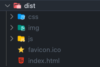

## micro frontend demo

## 微前端

### Why micro frontend

康威定律

> Any organization that designs a system (defined broadly) will produce a design whose structure is a copy of the organization's communication structure.

> 对于（广义）系统的设计组织，其设计产物的结构就是该组织内沟通结构的副本。

简单说，组织沟通方式决定系统设计。主要的设计理念，都离不开这个设定。

放到具体场景中来思考，比如说有一个产品，涉及到 300+ 个页面，很显然不能由一个小团队开发（开发周期过长），那就涉及到模块的拆分，不同团队之间的配合。不同的团队，习惯的技术栈和编码习惯都会不同，同时开发一个应用，沟通成本可想而知（比如说，git 的冲突都能给你烦死）。

还有一种常见的场景，在一个产品的不断开发和迭代中，可能会产生巨石应用（monolith）。所谓的巨石应用，就是功能非常复杂，模块间耦合度非常高的应用。后续技术更新，或者遇到其他问题时，打算重构项目，就会发现整个项目铁板一块，不敢乱动。同时，巨石应用的 codebase 非常大，每次打包消耗就很大。有些时候只是做了一点点修改，例如修改一个常量，却要全量打包，漫长的等待让人心烦。

简单总结，微前端希望解决的问题：

1. 实现多个项目独立开发，只是在客户端显示整合为一个应用。
2. 解决技术栈限制，支持技术栈异构。
3. 子项目间解耦，独立部署上线。
4. 实现递增的重构，不需要一次性完成全部。

### 什么是 SPA（单页应用）

**我们现在使用 Vue 大多数都是做的 SPA，字面意思理解，就是只有一个页面的应用。正常的一个应用，都不止一个页面，那么怎么理解这里的单页？**

下面是我们打包出来的目录结构。可以看到，只有一个名为 index 的 html 文件，并不能看到我们开发时候，创建的各种页面。

<div align="left">
  
</div>

```
dist
├── css               ------------> css 文件打包后的目录
├── favicon.ico       ------------> 浏览器 tab icon
├── img               ------------> 图片打包后目录
├── index.html        ------------> 入口文件
└── js                ------------> js 打包文件以及 source-map 描述文件所在目录
```

也就是说，单页面是针对服务部署而言的，SPA  应用在服务器上始终只有一个 index 页面，前端展示内容是通过劫持路由动态导入的。

这也就能解释，为什么说 hash 路由模式的 SPA 不利于 SEO，hash 模式利用的是锚点的方式，所以会被认为是一个页面。

### 微前端架构

同理，我们也会想到通过劫持路由，去跨应用加载，这样就可以做到模块独立部署，独立开发，更大程度的解耦。

项目架构


前端实现


### qiankun 接入

**主应用（这里使用的 Vue3 + vite）**

首先安装 qiankun

```js
npm i qiankun -S
```

main.ts 添加配置

```js
+ import "zone.js"; // 为了接入 angular 子应用，再引入 qiankun 前，先引入 zone.js
+ import { registerMicroApps, start } from "qiankun";  // 引入 qiankun

+ registerMicroApps([
+   {
+     name: "vue app", // sub app name registered
+     entry: "//localhost:8082", // sub app 部署地址
+     container: "#subapp-container", // 提供给 sub app 渲染的容器
+     activeRule: "/app-vue", // 提供给 sub app 的路由前缀
+   },
+   {
+     name: "angular app",
+     entry: "//localhost:8089",
+     container: "#subapp-container",
+     activeRule: "/app-angular",
+   },
+ ]);

+ start(); // 启动
```

App.vue 中添加导航，以及容器

```html
<div id="app">
    <div id="nav">
      <router-link to="/">Home</router-link> |
      <router-link to="/about">About</router-link> |
      <router-link to="/app-vue">Sub-Vue</router-link> |
      <router-link to="/app-angular">Sub-Angular</router-link>
    </div>
    <div class="content">
      <router-view />
      /*  提供给 sub app 渲染的位置  */
      <div id="subapp-container"></div> 
    </div>
 </div>
```

***tips： 对于 angular 子应用来说，需要使用 zone.js 进行编译，需要在主应用和 angular 子应用手动安装：***

```js
npm i zone.js -S
```


**Vue 子应用（Vue3 + Vue-cli）**

子应用不需要安装 qiankun，目前对于 webpack 的构建项目支持比较完善。可以查看 [官网示例](https://qiankun.umijs.org/zh/guide/tutorial#vue-%E5%BE%AE%E5%BA%94%E7%94%A8)

1. src 目录下添加 public-path.js 文件，内容为：

```js
if (window.__POWERED_BY_QIANKUN__) {
  __webpack_public_path__ = window.__INJECTED_PUBLIC_PATH_BY_QIANKUN__;
}
```

2. 入口文件 `main.js` 修改，为了避免根 id `#app` 与其他的 DOM 冲突，需要限制查找范围。

```js
import { createApp } from "vue";
import { createRouter, createWebHistory } from "vue-router";
import App from "./App.vue";
import routes from "./router";
import "./public-path";

let router = null;
let instance = null;
function render(props = {}) {
  const { container } = props; // 接受 qiankun 创建的 shadow DOM
  router = createRouter({
    // 为了兼容独立运行，需要判断是否运行在 qiankun 环境上
    // 修改路由的 base
    history: createWebHistory(
      window.__POWERED_BY_QIANKUN__ ? "/app-vue/" : "/"
    ),
    routes,
  });

  instance = createApp(App); // 获取根实例
	// 挂载时，需要判断是否运行在 qiankun 环境
  // 如果是，需要将应用挂载到 qiankun 提供的 shadow DOM 下面
  // 防止和其他应用冲突
  instance
    .use(router)
    .mount(container ? container.querySelector("#app") : "#app");
}

// 独立运行时
if (!window.__POWERED_BY_QIANKUN__) {
  render();
}
// 暴露三个给 qiankun 调用的 hooks
export async function bootstrap() {}
export async function mount(props) {
  render(props);
}
export async function unmount() {
  // Vue3 使用 unmount， $destroy 已被移除
  instance.unmount();
  instance = null;
  router = null;
}

```

3. 打包配置修改（`vue.config.js`）

```js
const { name } = require('./package');
module.exports = {
  devServer: {
    headers: {
      'Access-Control-Allow-Origin': '*', // 核心配置，支持跨域
    },
  },
  configureWebpack: {
    output: {
      library: `${name}-[name]`,
      libraryTarget: 'umd', // 把微应用打包成 umd 库格式
      jsonpFunction: `webpackJsonp_${name}`,
    },
  },
};
```


**Angular 子应用（Angular 13）**

Angular 需要配置的东西比较多，这里使用的是 Angular， single-spa 针对 Angular 有插件支持 [ single-spa-angular ](https://single-spa.js.org/docs/ecosystem-angular)。

首先使用 cli 创建项目

```
ng new my-app --routing --prefix my-app
cd my-app
ng add single-spa-angular // 添加插件
```

这样大部分配置，插件都已经配置好了。接下来需要针对 app 组件进行配置。

app.module.ts 添加 EmptyRouteComponent 的声明

```js
// EmptyRouteComponent 组建插件已经创建好了
import { EmptyRouteComponent } from './empty-route/empty-route.component';

@NgModule({
  declarations: [AppComponent, EmptyRouteComponent],
  imports: [BrowserModule, AppRoutingModule],
  providers: [],
  bootstrap: [AppComponent],
})
```

app-routing.module.ts 添加 APP_BASE_HREF 配置，并添加路由

```js
+ import { APP_BASE_HREF } from '@angular/common';
+ import { EmptyRouteComponent } from './empty-route/empty-route.component';

+ const routes: Routes = [{ path: '**', component: EmptyRouteComponent }];

@NgModule({
  imports: [RouterModule.forRoot(routes)],
  exports: [RouterModule],
+  providers: [{ provide: APP_BASE_HREF, useValue: '/' }],
})
```

src 目录下添加 public-path.js 文件，内容为：

```js
if (window.__POWERED_BY_QIANKUN__) {
  // eslint-disable-next-line no-undef
  __webpack_public_path__ = window.__INJECTED_PUBLIC_PATH_BY_QIANKUN__;
}
```

修改入口文件，`src/main.ts` 文件。给 qiankun 暴露出 hooks

```js
import './public-path';
import { enableProdMode, NgModuleRef } from '@angular/core';
import { platformBrowserDynamic } from '@angular/platform-browser-dynamic';
import { AppModule } from './app/app.module';
import { environment } from './environments/environment';

if (environment.production) {
  enableProdMode();
}

let app: void | NgModuleRef<AppModule>;
async function render() {
  app = await platformBrowserDynamic()
    .bootstrapModule(AppModule)
    .catch((err) => console.error(err));
}
if (!(window as any).__POWERED_BY_QIANKUN__) {
  render();
}

export async function bootstrap(props: Object) {
  console.log(props);
}

export async function mount(props: Object) {
  render();
}

export async function unmount(props: Object) {
  console.log(props);
  // @ts-ignore
  app.destroy();
}
```

最后安装插件 @angular-builders/custom-webpack，使用插件可以安装自定义的打包规则。
